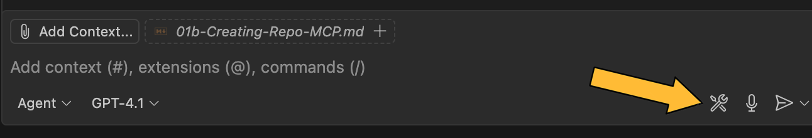

# Creating a GitHub Repository Using `GitHub MCP`

⚙️&emsp;This guide explains in detail how to create a new GitHub repository using the GitHub Copilot Model Context Protocol (MCP) extension installed in Visual Studio Code.  
⚙️&emsp;The MCP extension allows you to automate repository management tasks, including repository creation, directly from the VS Code interface using natural language prompts.  

---

## Prerequisites

- A GitHub account ([Sign up here](https://github.com/join){target="_blank"} if you don't have one)
- `GitHub account` with permission to create repositories
- A web browser (e.g., Chrome, Firefox, Safari)
- `Visual Studio` Code installed on your computer
- The `GitHub Copilot MCP` extension installed in VS Code

---

!!! example "Task: Create a new GitHub repository"

### 1. Install (MCP Extension)

1. Open Visual Studio Code.
2. Go to the Extensions view (`Ctrl+Shift+X` or `Cmd+Shift+X` on Mac).
3. Search for `GitHub Copilot MCP` and click **Install**, or go to [https://code.visualstudio.com/mcp](https://code.visualstudio.com/mcp)
4. Verify the installation by checking if the extension appears in the list of installed extensions.
5. Verify the MCP server by opening `GitHub Copilot chat`, clicking on the settings icon, and ensuring the server status is "Running".

---

### 2. Authenticate with GitHub

1. After installation, you may be prompted to sign in to your GitHub account.
2. Follow the on-screen instructions to complete authentication.

---

### 3. Open the Copilot Chat

* Click on the Copilot icon in the sidebar or open the Copilot Chat panel from the Command Palette (`Cmd+Shift+P` > "Copilot: Chat")
* Verify that the MCP is enabled. 

!!! explore "Verify MCP srver"
    
    {width=800}
    {width=800}
---

### 4. Create repo from Prompt

* In the Copilot Chat panel, enter a prompt such as:

!!! abstract "Prompt to create GitHub repository using GitHub Copilot MCP"

    ```text
    Using GitHub Copilot MCP
    Create a new GitHub repository named "GitLab-MCP-Repo"
    Make it public and add a README and a Python .gitignore
    Add policy to protect the 'main' branch
    ```

* You can customize the prompt to include details like description, visibility (public/private).license, and more. Here are some example prompts:

---

### 5. Verify (VsCode)

* In the VsCode Github Copilot Chat panel, you should see something like:


---

### 6. Verify (GitHub)

* Navigate to your GitHub account and go to the "Repositories" tab.
* You should see the newly created repository "GitLab-MCP-Repo" listed there.
* Click on the repository to view its contents and verify that the `README` and `.gitignore` files have been created.


---

## References

- [GitHub Copilot MCP Documentation](https://docs.github.com/en/copilot){target="_blank"}
- [GitHub Copilot in VS Code](https://code.visualstudio.com/docs/copilot/overview){target="_blank"}


