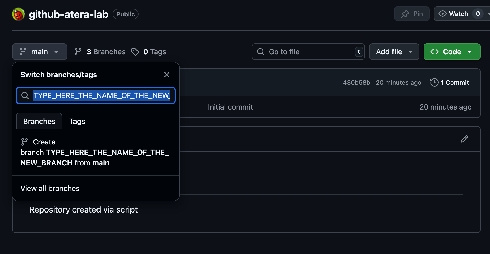
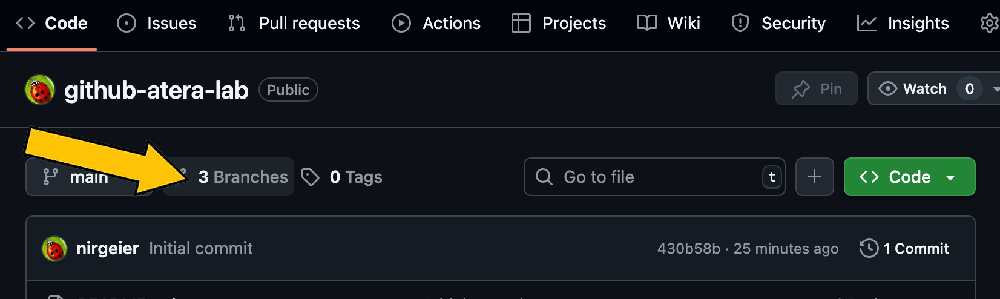

# Creating Branches Using GitHub GUI

- This guide explains how to create branches in a GitHub repository using the GitHub web interface (GUI). Branching allows you to work on new features, bug fixes, or experiments in isolation from the main codebase.

---

!!! example "Task: Create Branches and verify"

## 1. Navigate to Your Repository

- Go to [github.com](https://github.com) and sign in.
- Click on your repository from the list or search for it.

---

## 2. Open the Branch Selector

- At the top left of your repository page, locate the **branch selector dropdown** (usually says `main` or `gh-pages`).
- Click the dropdown to view existing branches.

---

## 3. Create a New Branch

- Create 2 branches: `bugfix-branch`, `feature-branch`.
- In the branch selector, type the name of your new branch
- GitHub will show an option: `Create branch: <your-branch-name>` from `<current-branch>`.
- Click this option to create and switch to the new branch.

---

## 4. Verify the New Branches

- The branch selector should now display your new branch name.
- Click on the `Branches` tab under the `Code` section to view all branches in the repository.
- Verify that your new branches (`bugfix-branch`, `feature-branch`) are listed.

---

### Additional Resources

- [GitHub Docs: Creating and deleting branches within your repository](https://docs.github.com/en/github/collaborating-with-issues-and-pull-requests/about-branches)
- [Working with Branches (CLI)](01c-Creating-Repo-gh.md)

