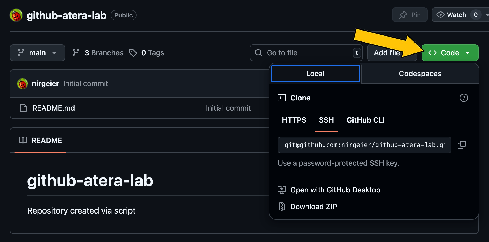
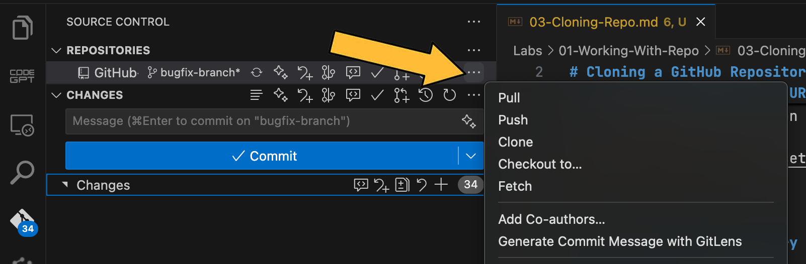

# Cloning a GitHub Repository

- This guide explains how to clone a repository from GitHub to your local machine using the GitHub website and Git.
- Clone "downloading" the repository to your local machine.
- This allows you to work on the project locally and push changes back to the remote repository.

---

!!! example "Task: Clone the repository locally"

## 1: Find the Repository

1. Go to [https://github.com](https://github.com){target="_blank"} and log in.
2. Navigate to the repository you want to clone.

---

## 2: Copy the Repository URL

1. Click the green **Code** button on the repository page.
2. Choose the desired protocol:
      - **HTTPS** (recommended for most users)
      - **SSH** (requires SSH key setup from setup step 1)
      - **GitHub CLI**
3. Click the clipboard icon to copy the URL.



---

## 3a: Clone the Repository Locally (CLI)

1. Open your terminal or command prompt.
2. Run the following command, replacing `<URL>` with the copied repository URL:
3. A new folder with the repository's name will be created in your current directory.
   ```sh
   git clone <URL> [<local-directory>]
   ```

---

## 3b: Clone the Repository (VSCode)

1. Open Visual Studio Code.
2. Go to the Source Control view (`Ctrl+Shift+G` or `Cmd+Shift+G` on Mac).
3. Click on the "Clone Repository" button.
4. Paste the copied repository URL and choose a local directory.
5. Click "Clone" to create a local copy of the repository.



---

## 4: Start Working

1. Change into the repository directory:
   ```sh
   cd <repository-name>
   ```
2. You can now start working with the code locally.

---

### Additional Resources

- [GitHub Docs: Cloning a repository](https://docs.github.com/en/github/creating-cloning-and-archiving-repositories/cloning-a-repository){target="_blank"}


