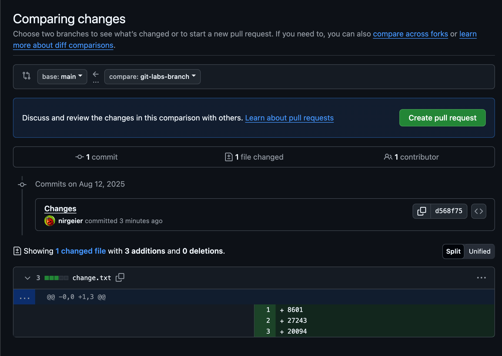

# Opening Pull Requests via GitHub Web Interface {.css-random-1}

This guide explains how to create pull requests using the GitHub web interface. This is the most visual and user-friendly method for creating pull requests.

---

## Prerequisites

- A repository with at least one branch containing changes
- Proper authentication setup with GitHub
- Your feature branch has been pushed to the remote repository

---

!!! explore "Task: Create pull request on GitHub"


---

## 1. Navigate to Pull Request 

1. Go to your repository on [GitHub.com](https://github.com){target="_blank"}
2. Navigate to the **"Pull requests"** tab

---

## 2. Create Pull Request

1. Click the **"Compare & pull request"** button (appears automatically after pushing a new branch)

{width="800px"}]

   **OR**
   
2. Navigate manually:
   - Click the **"Pull requests"** tab
   - Click **"New pull request"**
   - Select the base branch (usually `main` or `master`)
   - Select your feature branch as the compare branch
   - Click on `Create pull request`

{width="800px"}]

---

## 3. Fill Pull Request Details

1. **Title**: Provide a clear, descriptive title
      ```text
      Example: Add user authentication feature
      ```
2. **Description**: Include detailed information:
 
    For example:  
         
    - Why the change is needed.  
    - What changes were made. 
    - How to test the changes. 
    - Additional context or screenshots. 

       ```markdown
       ## Description
       This PR is from GitHub Workshop.

       ## Changes Made
       - Added change line
       - Implemented creation of PR
       - Added description to the PR

       ## Testing
       - [x] Unit tests pass
       - [x] Manual testing completed
       - [x] No breaking changes
       
       ## Screenshots
       (Add relevant screenshots if applicable)
       ```

3. **Reviewers**: Add reviewers by typing their GitHub usernames  
  
4. **Assignees**: Assign yourself or team members.  
   
5. **Labels**: Add appropriate labels (feature, bugfix, etc.).  

6. **Projects**: Link to project boards if applicable.  

7. **Milestone**: Associate with project milestones.  

---

## 4: Choose PR Type

1. Choose PR type:

    | PR Type                       | Description                        |
    | ----------------------------- | ---------------------------------- |
    | **Create pull request**       | For standard PRs ready for review. |
    | **Create draft pull request** | For work-in-progress.              |

2. Click the **"Create pull request"** button to submit your PR.

