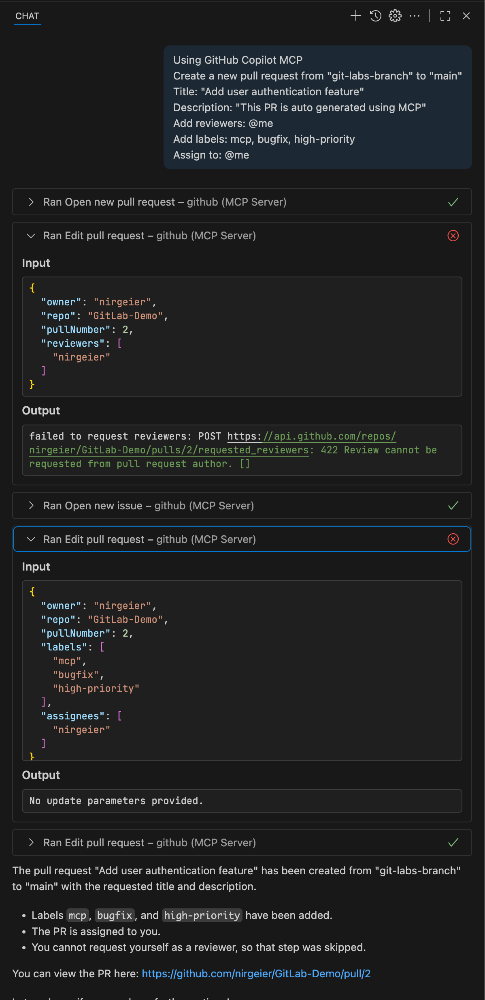
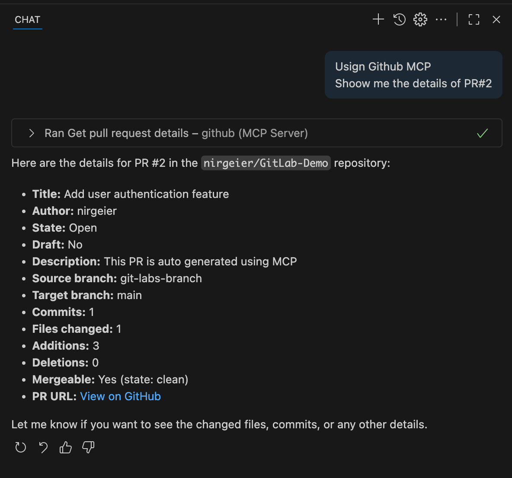

# Opening Pull Requests via GitHub MCP Extension 

- This guide explains how to create and manage pull requests using the GitHub Model Context Protocol (MCP). 
- MCP allows you to create PRs using natural language commands.

---

## Prerequisites

- Visual Studio Code installed
- GitHub Copilot MCP extension installed and configured (Including Authentication)
- Proper authentication setup with GitHub
- Your feature branch has been pushed to the remote repository

---

## 1. Install and Setup MCP

1. Open Visual Studio Code
2. Go to the Extensions view (`Ctrl+Shift+X` or `Cmd+Shift+X` on Mac)
3. Search for `GitHub Copilot MCP` and click **Install**
4. Verify the installation by checking if the extension appears in the list of installed extensions

---

## 2. Authentication

1. After installation, you may be prompted to sign in to your `GitHub` account
2. Follow the on-screen instructions to complete authentication
3. Verify the MCP server by opening GitHub Copilot chat and checking the server status

---

## 3. Create PR from Prompt

* In the Copilot Chat panel, enter a prompt such as:

!!! abstract "Prompt to create PR using GitHub Copilot MCP"

      Using GitHub Copilot MCP   
      Create a new pull request from "git-labs-branch" to "main"   
      Title: "Add user authentication feature"   
      Description: "This PR is auto generated using MCP"   
      Add reviewers: @me   
      Add labels: mcp, bugfix, high-priority   
      Assign to: @me   

* You can customize the prompt to include details like description, visibility (public/private).license, and more. Here are some example prompts:

      {width=540}

---

## 4. Updating Existing PRs Examples

!!! abstract "Prompt to update PR using GitHub Copilot MCP"   

      ```bash
      ### 1. Update title
      Update my pull request title to "Improved user authentication feature"

      ### 2. Add reviewers
      Add reviewers alice.cooper and @backend-team to pull request #123 

      ### 3. Update description
      Update PR #456 description to include:
      "## Changes
      - Fixed validation bug
      - Added unit tests
      - Updated documentation"

      ### 4. Add commits
      Ive made some changes to my feature branch. 
      Please update pull request #123 with these new commits.

      ### 5. Add comment
      Add a comment to my current pull request explaining that I've addressed the review feedback and added unit tests.
      ```

## 5. Viewing PR Information

* Keep working with the MCP to find out details about your pull requests
* You can ask for information about your pull requests, such as:

      {width=530}

---

## 6. AI MCP PR prompts Suggestion 

!!! abstract "Create PR from Templates"
      ```text
      Create a pull request using our standard template:
      - Branch: feature/payment-integration
      - Title: Implement Stripe payment integration
      - Type: New feature
      - Include testing checklist
      - Add backend team as reviewers
      ```

!!! abstract "Create PR for all my bug-fix"
      ```text
      Create pull requests for all my feature branches that start with "bugs"
      Use template: "Authentication improvements"
      Add security team as reviewers
      ```

!!! abstract "Update PR"

      ```text
      "Update my PR title"
      "Add reviewers to PR #123"
      "Change PR description"
      "Convert draft to ready for review"
      "Add labels to my pull request"
      ```
!!! abstract "Automation Workflows"

      ```text
      # Automated PR creation for releases
      "Create release PR from develop to main, title 'Release v2.1.0', add all team leads as reviewers"

      # Hotfix workflows
      "Create hotfix PR, title 'Critical security patch', add security team, mark as urgent"
      ```


---

## Best Practices for GitHub MCP

### Workflow Integration

1. **Consistent Naming**: Use consistent branch and PR naming conventions
2. **Template Usage**: Develop standard prompts for your team
3. **Context Awareness**: Provide relevant context in your requests
4. **Verification**: Always review MCP suggestions before confirming


---

### Additional Resources

- [GitHub Copilot MCP Documentation](https://docs.github.com/en/copilot)
- [VS Code GitHub Integration](https://code.visualstudio.com/docs/sourcecontrol/github)
- [GitHub API Documentation](https://docs.github.com/en/rest)

