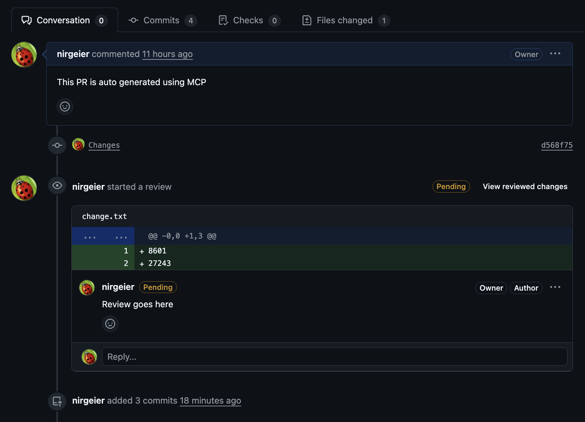

# Track Review Status and Respond

- This lab explains how to track a pull request’s review status, respond to feedback, handle CI checks, and prepare a PR for merge.

---

!!! explore "Task: Track Review Status and Respond (Comments)"

## 1. Where to Check Status

Use these areas on the PR page to see review progress and merge readiness.

| Area                | What you’ll see                                                                                                   |
| ------------------- | ----------------------------------------------------------------------------------------------------------------- |
| Conversation tab    | Full timeline of activity (comments, reviews, commits, CI events) show open/resolved state and who resolved them. |
| Reviewers (sidebar) | Requested reviewers/teams, who approved, who requested changes, and “Re-request review” actions.                  |
| Checks tab          | CI status, required and optional checks, and detailed logs for failures.                                          |
| Merge box (bottom)  | Mergeability summary: approvals required, checks passing/failing, branch conflicts, and protection rules.         |
| Files changed       | Open/Outdated/Resolved threads inline, “Viewed” checkboxes, file filter, diff settings.                           |

---

## 2. Respond to Review Feedback

1. Open the Conversation tab and review all open threads that need action.
2. Go to Files changed and expand files with comments.
3. Play around with the review and reply/comment on the feedback.
      - Click Reply, answer/comment on the feedback.
      - Accept a suggested change if provided.
      - When required, click **Resolve**. 
      - Reopen **Resolved** threads if needed.

!!! tip

    Use diff settings to speed up review:   
    
    * Hide whitespace changes (A very useful setting for ignoring formatting changes)   
    * Expand context (Show more lines)
    * Toggle rich diff for binaries like images/Markdown
    * Mark files as Viewed to track progress (Useful when you are working on multiple files)

---

## 3. Update the PR with Fixes

1. Make your tweaks on the same branch (e.g., `git-labs-branch`).
2. Commit and push, the PR updates itself and you’ll see a refresh banner.
3. If you see a `Refresh` button, click it to update the PR view.

