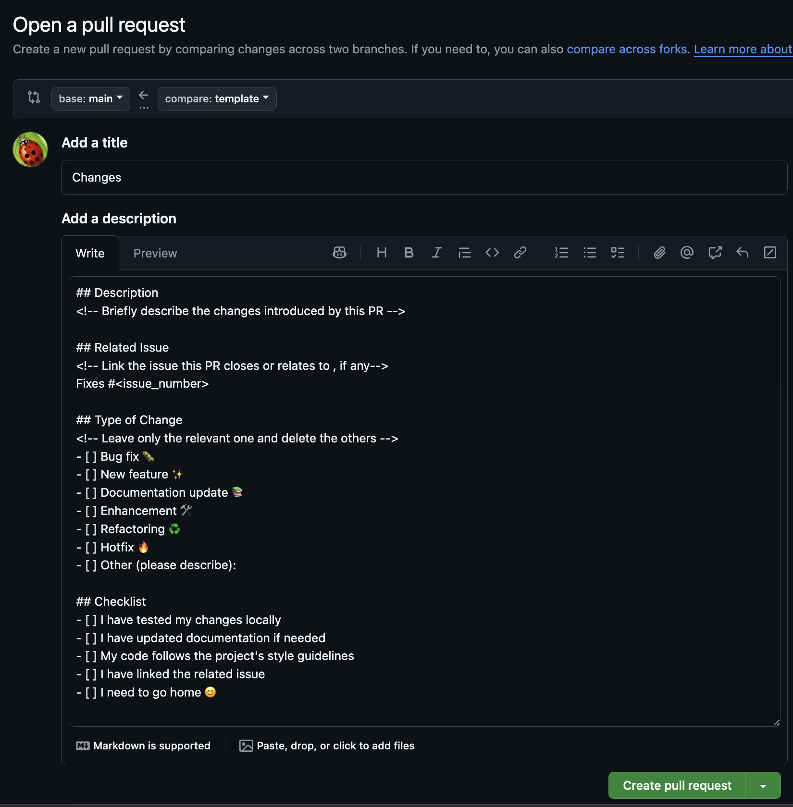
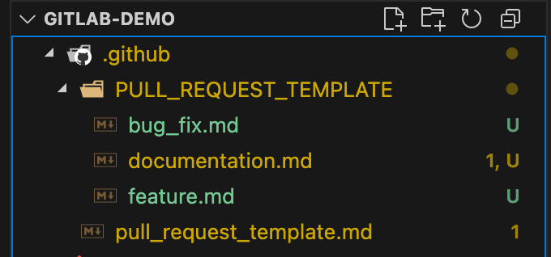

# Creating and Using Pull Request Templates

- This lab shows how to create and use PR templates to standardize pull request descriptions and ensure consistent information across your team.

---

!!! explore "Task: Create and Use a PR Template"

## 1. Understanding PR Templates

* PR templates automatically populate the description field when someone creates a new pull request. 
* They help us with the following:
    - Maintain consistent information across all PRs
    - Ensure required details aren't missed
    - Facilitate faster code reviews with better context
    - Provide clear linking between PRs and issues

---

## 2. Create the Template File

1. Create a new branch (So you can work on the template without affecting the main branch).
2. In your repository root, create a `.github` folder if it doesn't exist.
3. Inside `.github`, create a file named `pull_request_template.md`.
4. Add your template content using markdown syntax.

The file structure should look like:

```text
your-repo/
├── .github/
│   └── pull_request_template.md
```

---

## 3. Template Content

Here's a comprehensive template that covers most use cases:

```markdown
## Description
<!-- Briefly describe the changes introduced by this PR -->

## Related Issue
<!-- Link the issue this PR closes or relates to , if any-->
Fixes #<issue_number>

## Type of Change
<!-- Leave only the relevant one and delete the others -->
- [ ] Bug fix 🐛
- [ ] New feature ✨
- [ ] Documentation update 📚
- [ ] Enhancement 🛠️
- [ ] Refactoring ♻️
- [ ] Hotfix 🔥
- [ ] Other (please describe):

## Checklist
- [ ] I have tested my changes locally
- [ ] I have updated documentation if needed
- [ ] My code follows the project's style guidelines
- [ ] I have linked the related issue
- [ ] I need to go home 😊

## Screenshots (if applicable)
<!-- Add before/after screenshots for UI changes -->

## Additional Notes
<!-- Anything else reviewers should know -->
```

---

## 4. Create the Template File in Your Repo

!!! failure "Creating the Template File"

    Make sure you create the template file in the correct location.(`.github` folder) or else it will not work.


1. Switch to the `main` branch.
2. Switch to your repository root folder.
3. Create new file with the **specific name** `.github/pull_request_template.md`
4. Copy the template content [from above](#3-template-content) into the file.
5. Commit and push the changes

---

## 5. Using the Template

1. Make changes, add, commit & push your code.
2. Create a new pull request as usual.
3. The template will automatically appear in the description field.

{width=800}

---

!!! explore "Task: Create and Use Custom PR Template"


## 6. Multiple Templates

You can create different templates for different types of PRs:

```text
.github/
├── PULL_REQUEST_TEMPLATE/
│   ├── bug_fix.md
│   ├── feature.md
│   └── documentation.md
└── pull_request_template.md (default)
```

1. Create a new file **for each** template in the `.github/PULL_REQUEST_TEMPLATE/` directory.
2. Write your template content using markdown syntax.
3. You can set a template name and description:
  ```yaml
  name: Bug Fix
  description: Use this template for bug fixes
  ```
4. Add, commit, and push your changes.

    {width=400}

!!! example "ISSUE_TEMPLATE"

    * GitHub support Issue Template as well.
    * Same concept but in different folder.
    * `.github/ISSUE_TEMPLATE/`
    
---

## 7. Using PR template

!!! info "Default Template"
    
    In order to use the default PR template, simply create a new pull request as you normally would.

!!! danger "Custom Template"

    In order to use a custom PR template, you can specify the template in the URL when creating the PR.

    ```text
    ###
    ### https://github.com/owner/repo/compare/<branch to>...<branch_from>?template=<template>

    https://github.com/owner/repo/compare/main...feature?template=feature.md
    ```
    [Using query parameters to create a pull request](https://docs.github.com/en/pull-requests/collaborating-with-pull-requests/proposing-changes-to-your-work-with-pull-requests/using-query-parameters-to-create-a-pull-request)
    
---

## 8. Testing Your Template

1. Create a test branch:

```bash
git checkout -b test-pr-template
git push origin test-pr-template
```

2. Open a new PR from this branch to see the template in action.
3. Verify all sections appear correctly and make adjustments if needed.
