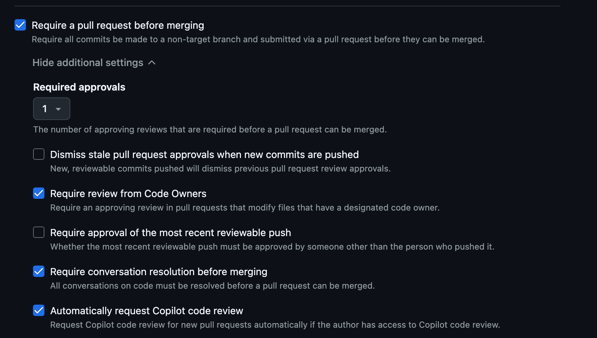
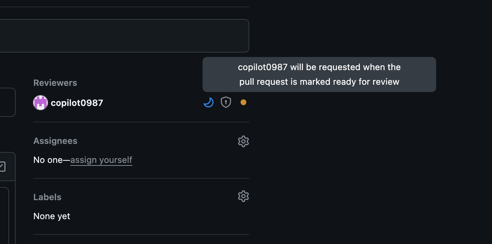

# Implementing CODEOWNERS for Pull Request Automation

🧩 This hands-on lab walks you through adding a `CODEOWNERS` file to automatically assign reviewers and enforce ownership rules on pull requests.

---

## 1. Using CODEOWNERS 

- `CODEOWNERS` is a file that allows you to **define individuals or teams responsible for specific parts of your codebase**. 
- When changes are made to those areas, the designated code owners are automatically requested for review.
- This helps ensure that the right people are reviewing changes to critical parts of the code.
- `CODEOWNERS` can also be used to enforce review policies, such as requiring approval from code owners before merging.


!!! info "**How CODEOWNERS Works**"

    - Automatically assigns reviewers based on file changes
    - Ensures domain experts review relevant code
    - Can be combined with branch protection rules
    - Supports teams and individual users

    --- 

    * Create `.github/CODEOWNERS` in your repository:

        ```text
        # Global owners
        * @username @team-name

        # Frontend code
        /src/components/ @frontend-team
        /src/styles/ @design-team

        # Backend code
        /api/ @backend-team
        /database/ @backend-team @database-admin

        # Infrastructure
        /.github/ @devops-team
        /docker/ @devops-team
        ```

---

## 2. CODEOWNERS - Files location

GitHub search for the first matching file in following order:

  1. `.github/CODEOWNERS`
  2. `CODEOWNERS` in the repository root
  3. `docs/CODEOWNERS`

!!! tip 

    Recommended: Use `.github/CODEOWNERS` for consistency with other meta files (workflows, templates).

---

## 3. CODEOWNERS - Pattern

| Pattern Type          | Example                | Matches                           |
| --------------------- | ---------------------- | --------------------------------- |
| Single file           | `README.md`            | Exact file                        |
| Directory (recursive) | `src/`                 | Everything under `src/`           |
| Specific extension    | `*.md`                 | All Markdown files                |
| Nested path           | `app/api/`             | Files in that folder & subfolders |
| Escaping `#`          | `\#file.txt`           | File literally named `#file.txt`  |
| Comment line          | `# owners of infra`    | Ignored                           |
| Last match wins       | Later entries override | Use ordering intentionally        |

---

## 4. CODEOWNERS - Example

* Create directory (if needed):

    ```bash
    mkdir -p .github
    ```

* Add file `.github/CODEOWNERS`:

    ```bash
    # Global ownership (fallback)
    * nirgeier@gmail.com

    # Documentation
    /docs/ @your-org/docs-writers
    *.md   @your-org/docs-writers

    # Frontend code
    /src/components/ @your-org/frontend-team
    /src/styles/ @your-org/design-team

    ###
    ###... Any other paths or file types
    ###
    ```

* Add to git & push:

    ```bash
    git add .github/CODEOWNERS
    git commit -m "Add initial CODEOWNERS file"
    git push origin main
    ```

---

## 5. CODEOWNERS - Enable

If you have not enabled branch protection yet:

1. Go to: **Repository → Settings → Rules → Rulesets** (or Branches > Branch protection)
2. Create / Edit your ruleset targeting `main`
3. Enable the following
      - Require a pull request before merging
      - Require approvals: set to `1` (or more)
      - Require review from Code Owners 
      - Dismiss stale approvals (recommended)
      - Require conversation resolution
4. Save / Activate the ruleset



---

## 6. CODEOWNERS - Verify (Test)

* Open a pull request
* In the PR sidebar you should see:
* Reviewers automatically populated with teams/users from matching patterns.

  {width=800}

---

## 7. CODEOWNERS - Checklist

Use this checklist to validate success:

- [X] CODEOWNERS exists at `.github/CODEOWNERS`
- [X] Global `*` rule defined
- [X] At least one team + one individual user referenced (optional)
- [X] Branch protection requires Code Owner review
- [X] Test PR auto-assigned reviewers
- [X] Specific path override tested


