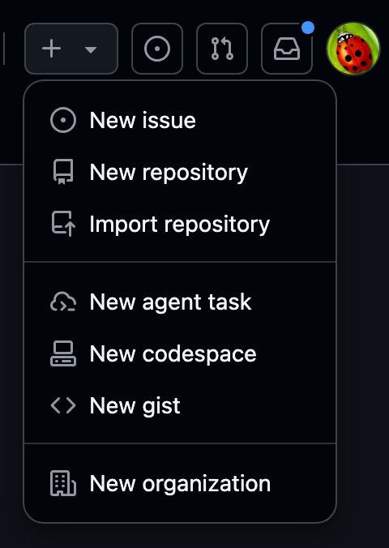
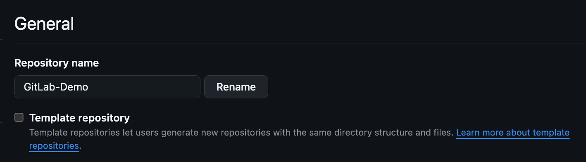

# Creating a Template Repository

- This lab shows how to create and use GitHub template repositories for new repositories.
- This lab will not cover all the possible configurations and customizations for template repositories.

---

## 1. Template Repositories. Why?

!!! tip "Template Benefits"

    - Template repositories are special GitHub repositories that serve as blueprints (bootstraps) for creating new repositories. 
    - Some of the templates include:

        - **Consistent project structure** across teams and organizations
        - **Pre-configured settings** like CI/CD pipelines, linting rules, and development tools
        - **Boilerplate code** and documentation templates
        - **Faster project initialization** without manual setup
        - **Best practices and guidelines** for project setup
        - **Customizable workflows** to fit specific project needs
        - **Integration with third-party tools** and services
        - **Automated setup scripts** for quick environment configuration
        - **Sample data and fixtures** to help kickstart development
        - **Documentation and tutorials** for using the template effectively
        - **Issue and pull request templates** for consistent contributions
        - **Custom scripts** for common tasks (e.g., setup, testing)
        - **Environment configuration files** (e.g., `.env.example`)

        ---   
        
        When someone creates a new repository from a template, they get a clean copy with all the template's files but none of its Git history.

---

## 2. Prepare Your Template Repository

Lets create a new repository on GitHub to serve as our template.

1. Go to [GitHub.com](https://github.com) and sign in to your account.
2. Click the **"+"** icon in the top-right corner and select **"New repository"**.
3. Choose a descriptive name like `my-project-template` or `react-app-template`.
4. Add a clear description explaining what the template is for.
5. Make the repository **Public** (templates work best when accessible).
6. Initialize with a README file.
7. Click **"Create repository"**.

!!! example "New Repository"
  
    {width=200}


!!! example "Template Repository"
    
    {width=800}

---

## 3. Create Repository Template Files

* A basic template project should look like:

      ```
      root /                                         # Repository root
      ├── .github /                                  # GitHub-specific configuration
      │   ├── workflows /                            # GitHub Actions workflow definitions
      │   │   └── ci.yml                             # CI pipeline (build/test/lint)
      │   ├── ISSUE_TEMPLATE/                        # Issue form/templates
      │   │   ├── bug_report.md                      # Bug report issue template
      │   │   └── feature_request.md                 # Feature request issue template
      │   └── pull_request_template.md               # PR description guidance
      ├── docs/                                      # Project documentation
      │   ├── CONTRIBUTING.md                        # How to contribute (standards, process)
      │   └── SETUP.md                               # Local environment / install steps
      ├── src/                                       # Application/source code
      │   └── (your project files)                   # Replace with actual modules/packages
      ├── tests/                                     # Test suite root
      │   └── (test files)                           # Unit/integration/e2e tests
      ├── .gitignore                                 # Ignore rules for Git
      ├── LICENSE                                    # Project license (e.g., MIT, Apache-2.0)
      ├── README.md                                  # Overview, usage, badges, quick start
      └── package.json (or equivalent)               # Dependency & script manifest (npm, etc.)
      ```

* Create any content you want to include in the template repository
* Add and commit your changes

---

## 4. Enable Template Mode

!!! note

    In order to use this repository as a template, you need to enable template mode.

{width=800}

1. Navigate to your repository on GitHub.
2. Click the **"Settings"** tab (top navigation bar).
3. Scroll down to the **"General"** section.
4. Find the **"Template repository"** checkbox.
5. Check the box to **"Template repository"**.
6. Click **"Save"** to confirm the changes.

---

## 5. Use the Template Repository

1. Log into GitHub.
2. Navigate to your template repository.
3. Click the green **"Use this template"** button (appears instead of "Clone").
4. Select **"Create a new repository"**.
5. Fill in the new repository details:
      - **Repository name**: Choose a descriptive name
      - **Description**: Describe the specific project
      - **Visibility**: Public or Private as needed
6. Choose whether to **"Include all branches"** (usually keep unchecked).
7. Click **"Create repository from template"**.
8. Your new repository will be created with all files and settings from the template.
