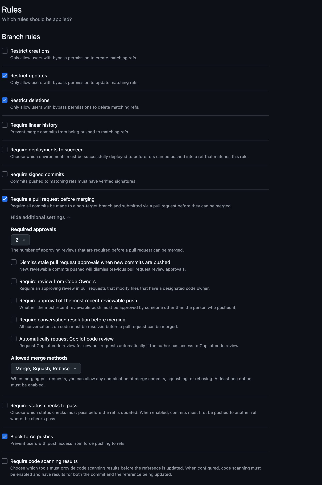

# GitHub Rulesets

- Rulesets are the modern way to enforce protections on branches across a repository (or organization). 
- Use a branch ruleset to standardize requirements like PR reviews, status checks, commit signing, and more.

### Understanding Ruleset / Branch Protection

!!! example "Branch protection rules help maintain code quality by:"

      - **Preventing direct pushes** to important branches like `main` or `develop`
      - **Requiring pull request reviews** before merging code
      - **Enforcing status checks** from CI/CD pipelines
      - **Restricting who can push** to protected branches
      - **Maintaining a clean commit history** with merge strategies
      - **Ensuring code review processes** by forcing pull request reviews
      - **Enabling automated testing** to catch issues early
      - **Maintaining a clean commit history** with merge strategies
      - **Enforcing coding standards** through automated checks
      - **Preventing accidental deletions** of important branches

## 1. Create Ruleset

1. Open the repository on GitHub and go to **Settings**
2. In the sidebar, select **Rules** → **Rulesets**
3. Click **New ruleset** and choose **New Branch Ruleset** as the target
4. Give the ruleset a meaningful name (for example, `Branch Protections - main`)
5. Set **Enforcement status** → **Active / Disabled** 
6. Set Target branches → **Add target** (which branches the rules apply to):
7. Configure Bypass list (optional):
      - Add specific users/teams that may bypass, and (if required)

!!! danger

    Bypass rules should be used sparingly and only for trusted users or teams.
    `Atera` Does have bypass rules 

---

{width=800}

---

## 2. Approvals
  
* Set the **Require a pull request before merging** → **Required Approvals**    

## 3. Merge Methods

* Set the **Allowed merge methods**   

    #### Squash

    - **Recommended for most teams**
    - Combines all commits into a single commit
    - Keeps main branch history clean
    - Easy to revert changes
    - Provides a clear commit history
    - Allows for better collaboration and code review
    - Simplifies the process of reverting changes

    #### Rebase 
    
      - Replays commits without creating merge commits
      - Creates linear history
      - Good for small, clean changes
      - Allows for easier bisecting of changes
      - Supports interactive rebasing
      - Requires careful management of commit history
      - Not recommended for large feature branches
     
    #### Merge committing

      - Creates merge commits that preserve branch history
      - Good for feature branch workflows
      - Allows for more complex merge scenarios
      - Requires careful management of merge conflicts
      - Not recommended for small changes

    #### Merge Strategy Recommendations

    | Workflow Type    | Recommended Strategy | Benefits                  |
    | ---------------- | -------------------- | ------------------------- |
    | Feature branches | Squash merge         | Clean main branch history |
    | Hotfixes         | Rebase merge         | Fast-forward integration  |
    | Release branches | Merge commit         | Preserve branch context   |
    | Small changes    | Squash merge         | Reduce commit noise       |

## 4. Status Checks

* Set the **Require status checks to pass** → **Require status checks to pass before merging**   
* Add the required checks 

!!! note "Require status checks to pass before merging"
    
- This ensures that all required checks pass before merging a pull request.
- It helps maintain code quality and prevents broken code from being merged.
- You can select specific checks like:
    - `ci/build`
    - `ci/test`
    - `security/code-scanning`
    - `quality/lint`
    - `Atera/specific_task`  

## 5. Branch Restrictions

* Those are several restrictions you can apply to branches
* Review the rules screen and you can see all the different configured restrictions

#### &emsp;&emsp; Task: Create rules for Development Branch

&emsp;&emsp;&emsp;&emsp;**Pattern**: `develop` or `dev`  
&emsp;&emsp;&emsp;&emsp;**Required reviewers**: 1   
&emsp;&emsp;&emsp;&emsp;**Status checks**: CI tests only  
&emsp;&emsp;&emsp;&emsp;**Allow force pushes**: No  

#### &emsp;&emsp; Task: Create rules for Release Branches

&emsp;&emsp;&emsp;&emsp;**Pattern**: `release/*`  
&emsp;&emsp;&emsp;&emsp;**Required reviewers**: 2  
&emsp;&emsp;&emsp;&emsp;**Status checks**: Full test suite  
&emsp;&emsp;&emsp;&emsp;**Restrict pushes**: Release managers only  

#### &emsp;&emsp; Task: Create rules for Feature Branches

&emsp;&emsp;&emsp;&emsp;**Pattern**: `feature/*`  
&emsp;&emsp;&emsp;&emsp;**Required reviewers**: 1  
&emsp;&emsp;&emsp;&emsp;**Status checks**: Basic CI  
&emsp;&emsp;&emsp;&emsp;**Allow force pushes**: Yes (for development)  

## 6. Copilot Code Reviews

* Set the **Require a pull request before merging** → **Automatically request Copilot code review**

