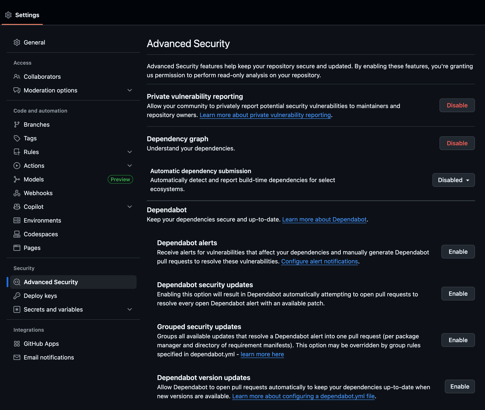
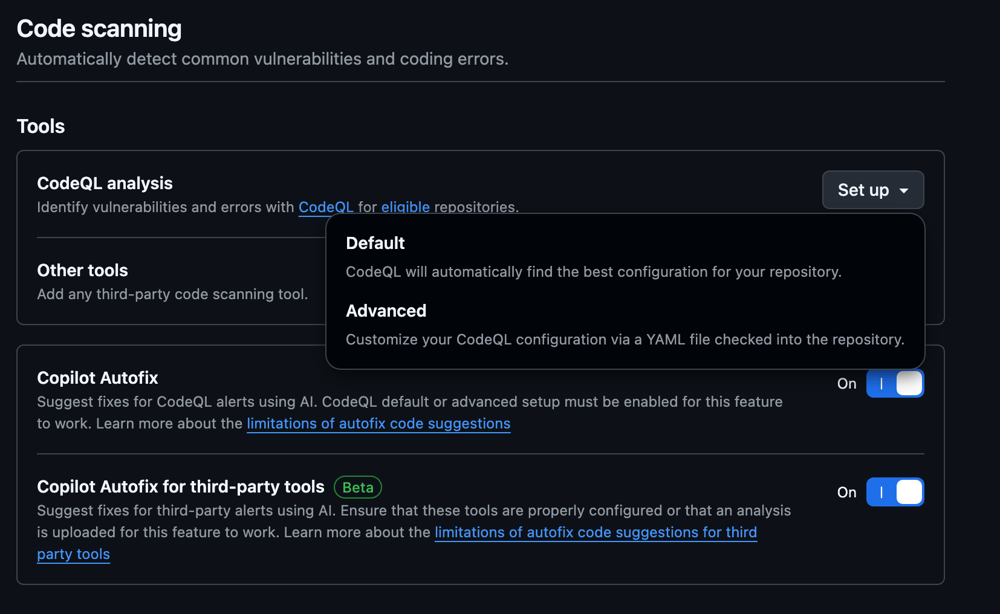

# Code Scann

- This lab walks through configuring GitHub's core application security features.
- You will enable and tune: **Code Scanning (CodeQL)**, **Secret Scanning (incl. Push Protection)**, and **Dependency Review**.
- Includes setup, workflow authoring, alert triage, automation, and integration with branch protection.

---

## 1. Why These Security Features Matter

!!! example "Security features help you shift-left by:"

    - **Automatically finding vulnerabilities** (CodeQL semantic analysis)
  	- **Preventing leaked credentials** before they land in `main` (Secret Scanning + Push Protection)
  	- **Catching risky dependency changes** *during code review* (Dependency Review)
  	- **Reducing mean-time-to-detect (MTTD)** with continuous scanning
  	- **Standardizing security gates** via required status checks
  	- **Enabling measurable SLAs** for remediation (alerts, severity, timelines)
  	- **Supporting audit & compliance** with immutable alert history

---

## 2. Prerequisites

| Area            | Requirement                                                                               |
| --------------- | ----------------------------------------------------------------------------------------- |
| Permissions     | Repository Admin (to enable security & analysis)                                          |
| Repo Visibility | All features free for public repos. Private repos need GHAS for CodeQL & Secret Scanning. |
| Branch Strategy | Protected default branch (e.g. `main`)                                                    |
| Code Languages  | CodeQL supports Java, Kotlin, C/C++, Go, C#, Python, Ruby, JS/TS, Swift, etc.             |
| CI              | CodeQL workflows consume Actions minutes                                                  |


!!! note

	If a language is not auto-detected specify explicitly (`languages: ['java','python']`).

---

## 3. Enable Security & Analysis Features

1. Navigate to the repository on GitHub.
2. **Settings → Advanced Security → Code scanning**.
3. Enable what ever you wish based upon your needs:
	- [X] Dependency graph
	- [X] Dependabot alerts
	- [X] Dependabot security updates (optional)
	- [X] Code scanning (Default or Advanced)
	- [X] Secret scanning
	- [X] Secret scanning: Push protection
4. Wait for activation banners.

!!! note
  
    Dependency Graph must be on for Dependency Review context.



---

## 4. Code Scanning (CodeQL)

{width=800}

### 4.1 Modes

| Mode                | Use Case                                   | Effort   |
| ------------------- | ------------------------------------------ | -------- |
| Default             | Fast enable, standard query packs          | Very Low |
| Advanced (workflow) | Custom build, multi-language, custom packs | Medium   |
| SARIF Upload        | Integrate external SAST tools              | Variable |

---

### 4.2 Quick Start (Default)

1. Security tab → Code scanning alerts.
2. Set up code scanning → Default → Enable CodeQL.
3. Initial analysis runs automatically.
4. Review alerts when finished.

---

### 4.3 Advanced Workflow

Create `.github/workflows/codeql.yml`:

```yaml
name: CodeQL

on:
	push:
		branches: ["main"]
	pull_request:
		branches: ["main"]
	schedule:
		- cron: '0 3 * * 1'

jobs:
	analyze:
		runs-on: ubuntu-latest
		permissions:
			actions: read
			contents: read
			security-events: write
		strategy:
			fail-fast: false
			matrix:
				language: [javascript, python]
		steps:
			- uses: actions/checkout@v4
			- name: Initialize CodeQL
				uses: github/codeql-action/init@v3
				with:
					languages: ${{ matrix.language }}
					# packs: codeql/javascript-queries@latest,codeql/python-queries@latest
					# config-file: ./.github/codeql/codeql-config.yml
			- name: Autobuild
				uses: github/codeql-action/autobuild@v3
			- name: Analyze
				uses: github/codeql-action/analyze@v3
				with:
					category: "/language:${{ matrix.language }}"
```

### 4.4 Custom Queries

Create `.github/codeql/codeql-config.yml`:

```yaml
name: Custom CodeQL Config
queries:
	- uses: security-extended
	- uses: security-and-quality
```
Reference with `config-file` in init step.

!!! tip
		Add `security-extended` after validating baseline noise.

### 4.5 Manual Build Example

```yaml
			- name: Build (Maven)
				run: mvn -B -DskipTests package
```

### 4.6 Triage Alerts
1. Security → Code scanning alerts.
2. Filter by severity / language.
3. Open alert → inspect data flow.
4. Fix or Dismiss (False positive, Won't fix, Used in tests, Acceptable risk).
5. Link fix via PR.

### 4.7 Suppress in Code (last resort)

```javascript
// codeql[js/incomplete-sanitization] Reason: validated upstream
```

### 4.8 Enforce via Branch Protection
Add CodeQL checks as required status checks after first successful run.

---

## 5. Secret Scanning

### 5.1 Push Protection Flow
1. Developer pushes commit with secret.
2. GitHub blocks push; shows remediation.
3. Developer removes secret (preferred) or bypasses with justification (audited).

### 5.2 Custom Patterns (GHAS)

Security → Secret scanning → Custom patterns → New pattern.
Example regex: `INT-API-[0-9A-F]{32}`

!!! warning
		Keep patterns specific to avoid false positives.

### 5.3 Triage
For each alert: verify exposure, revoke/rotate, optionally rewrite history, resolve with reason.

### 5.4 SLA Guidance
| Severity | Example             | SLA            |
| -------- | ------------------- | -------------- |
| High     | Cloud root keys     | 4 hours        |
| Medium   | Internal API tokens | 1 business day |
| Low      | Test credentials    | 3 days         |

---

## 6. Dependency Review

### 6.1 Use
Shows added/removed/updated dependencies, vulnerabilities, licenses in PR.

### 6.2 Workflow (optional gate)

`.github/workflows/dependency-review.yml`:

```yaml
name: Dependency Review
on: [pull_request]
permissions:
	contents: read
	pull-requests: read
jobs:
	review:
		runs-on: ubuntu-latest
		steps:
			- uses: actions/checkout@v4
			- uses: actions/dependency-review-action@v4
				with:
					fail-on-severity: high
					# allow-licenses: MIT,Apache-2.0
					# deny-licenses: GPL-3.0
					# comment-summary-in-pr: true
```

### 6.3 Dependabot Updates

`.github/dependabot.yml`:

```yaml
version: 2
updates:
	- package-ecosystem: npm
		directory: /
		schedule:
			interval: weekly
		open-pull-requests-limit: 5
	- package-ecosystem: pip
		directory: /
		schedule:
			interval: weekly
```

---

## 7. Branch Protection Integration

| Feature           | Check Name Example            | Action                  |
| ----------------- | ----------------------------- | ----------------------- |
| CodeQL            | CodeQL / Analyze (javascript) | Require                 |
| Dependency Review | Dependency Review / review    | Require                 |
| Secret Scanning   | (none)                        | Rely on push protection |

Add checks under Branch protection → Require status checks.

---

## 8. Alert Review Workflow

| Step      | Action             | Owner             |
| --------- | ------------------ | ----------------- |
| Detect    | Scan creates alert | Automation        |
| Triage    | Validate severity  | Security Champion |
| Assign    | Link issue/PR      | Eng Lead          |
| Remediate | Patch / rotate     | Developer         |
| Verify    | Confirm closure    | Security          |
| Report    | Metrics & trends   | Security Ops      |

!!! tip
		Tag security when dismissing or suppressing findings.

---

## 9. Advanced Topics

### 9.1 SARIF Upload (3rd Party)

```yaml
			- name: Upload SARIF
				uses: github/codeql-action/upload-sarif@v3
				with:
					sarif_file: results.sarif
```

### 9.2 Secret Pattern Anchoring

`\bAKIA[0-9A-Z]{16}\b`

### 9.3 Noise Reduction
- Start with default packs only.
- Audit dismissals; convert recurring false positives into custom query tweaks.
- Incrementally tighten severity gates.

### 9.4 License Policy
Use dependency review action `allow-licenses` / `deny-licenses` to enforce governance.

---

## 10. Metrics

| Metric                             | Target                 |
| ---------------------------------- | ---------------------- |
| CodeQL MTTR                        | < 14 days              |
| Secret Exposure Window             | < 1 hour high severity |
| Vulnerable Dependency Introduction | 0% High severity       |
| False Positive Rate                | < 10%                  |

---

## 11. Troubleshooting

| Issue                     | Cause                    | Fix                                    |
| ------------------------- | ------------------------ | -------------------------------------- |
| No CodeQL alerts          | Wrong language / no runs | Verify workflow triggers & languages   |
| Missing status check      | Name mismatch            | Copy exact check name post-run         |
| Push not blocked          | Pattern gap / bypass     | Add custom pattern, review bypass logs |
| Slow CodeQL job           | Large build              | Cache deps / split languages           |
| Dependency Review missing | Dependency graph off     | Enable in settings                     |

!!! note
		Some alerts appear only after first successful default branch scan.

---

## 12. Next Steps
1. Promote workflow & config to template repo.
2. Add CODEOWNERS for `.github/workflows/**`.
3. Export alerts weekly (governance dashboard).
4. Add security KPIs to sprint review.

---

By completing this lab you established a proactive security baseline using native GitHub: CodeQL, Secret Scanning, and Dependency-aware reviews. Iterate on queries, secret patterns, and gating policies as the codebase evolves.

