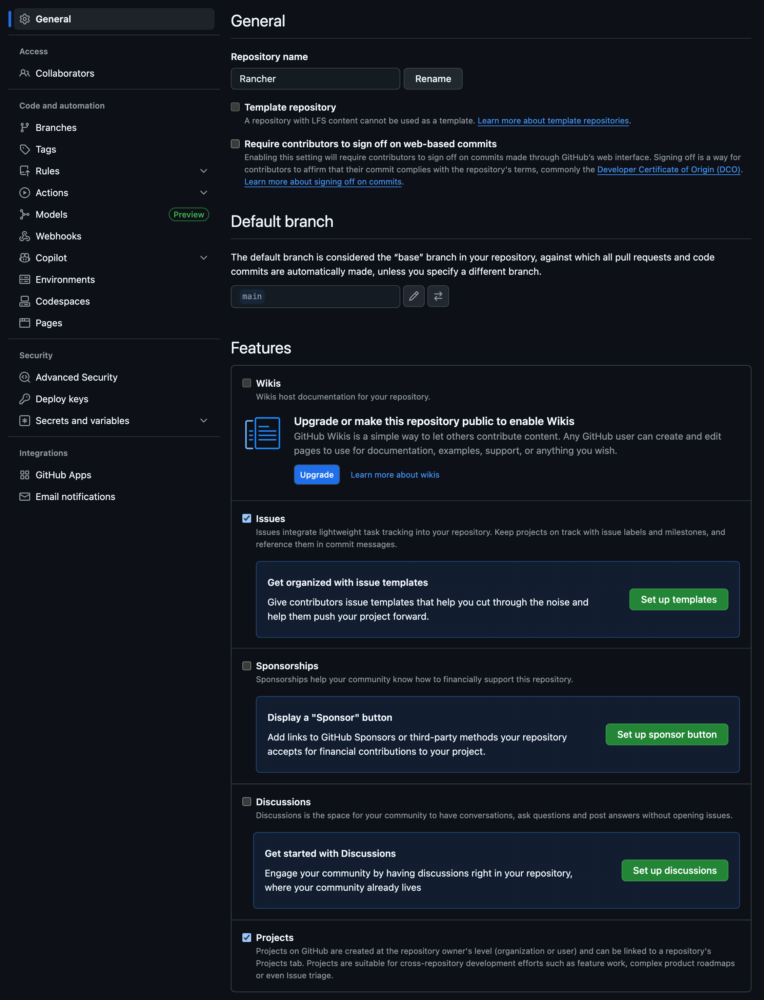
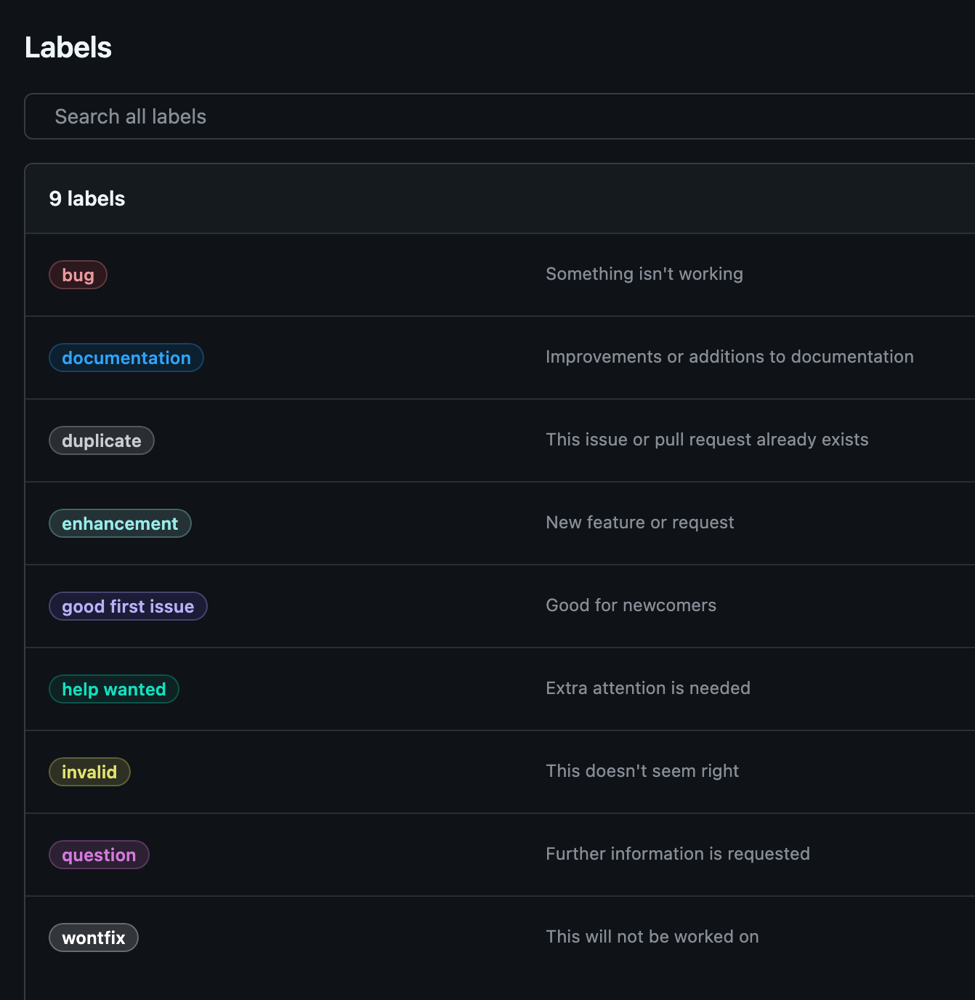

# GitHub Issues Management

- This guide covers GitHub Issues setup, templates, labels, and best practices for tracking bugs and feature requests.
- You'll learn to create structured issue workflows for effective project management.

---

## 1. Issues Overview

!!! tip "Issues Benefits"

    GitHub Issues provide a powerful way to track work on your repository:

    - **Bug Tracking**: Report and track software bugs with detailed information
    - **Feature Requests**: Collect and prioritize new feature ideas from users
    - **Task Management**: Break down work into manageable, trackable units
    - **Project Planning**: Link issues to milestones and project boards
    - **Team Communication**: Discuss solutions and collaborate on fixes
    - **Documentation**: Maintain a searchable history of problems and solutions
    - **Integration**: Connect with pull requests, commits, and automation
    - **Community Engagement**: Allow external contributors to report issues

---

## 2. Enable Issues

!!! note "Private Repositories"
    Issues are automatically enabled for public repositories but must be manually enabled for private repositories.

1. Navigate to your repository on GitHub
2. Click **"Settings"** tab
3. Click **"General"** tab
4. Scroll down to **"Features"** section
5. Ensure **"Issues"** checkbox is checked



---

## 3. Create Issue Templates

Issue templates standardize how bugs and features are reported, ensuring you get all necessary information.

### 3.1. Set Up Templates

1. In your repository, navigate to **"Settings"** → **"Features"**
2. Click **"Set up templates"** next to Issues
3. Choose from predefined templates or create custom ones

### 3.2. Bug Report Template

Create `.github/ISSUE_TEMPLATE/bug_report.md`:

    ---
    name: Bug report
    about: Create a report to help us improve
    title: '[BUG] '
    labels: 'bug'
    assignees: ''
    ---

    **Describe the bug**
    A clear and concise description of what the bug is.

    **To Reproduce**
    Steps to reproduce the behavior:
    1. Go to '...'
    2. Click on '....'
    3. Scroll down to '....'
    4. See error

    **Expected behavior**
    A clear and concise description of what you expected to happen.

    **Screenshots**
    If applicable, add screenshots to help explain your problem.

    **Environment (please complete the following information):**
     - OS: [e.g. iOS]
     - Browser [e.g. chrome, safari]
     - Version [e.g. 22]

    **Additional context**
    Add any other context about the problem here.

### 3.3. Feature Request Template

Create `.github/ISSUE_TEMPLATE/feature_request.md`:

    ---
    name: Feature request
    about: Suggest an idea for this project
    title: '[FEATURE] '
    labels: 'enhancement'
    assignees: ''
    ---

    **Is your feature request related to a problem? Please describe.**
    A clear and concise description of what the problem is. Ex. I'm always frustrated when [...]

    **Describe the solution you'd like**
    A clear and concise description of what you want to happen.

    **Describe alternatives you've considered**
    A clear and concise description of any alternative solutions or features you've considered.

    **Additional context**
    Add any other context or screenshots about the feature request here.

### 3.4. Custom Template

Create `.github/ISSUE_TEMPLATE/custom.md`:

    ---
    name: Custom issue
    about: Describe this issue template's purpose here.
    title: ''
    labels: ''
    assignees: ''
    ---

    **Summary**
    Brief description of the issue

    **Details**
    Detailed explanation of the request

    **Acceptance Criteria**
    - [ ] Criteria 1
    - [ ] Criteria 2
    - [ ] Criteria 3

---

## 4. Labels and Organization

### 4.1. Default Labels

GitHub provides default labels, but you should customize them for your project:

1. Go to **"Issues"** tab in your repository
2. Click **"Labels"** button
3. Review and edit existing labels

### 4.2. Recommended Label System

Create a comprehensive labeling system:

{width=600}

#### Type Labels
- `bug` (red) - Something isn't working
- `enhancement` (blue) - New feature or request
- `documentation` (purple) - Improvements or additions to documentation
- `question` (pink) - Further information is requested

#### Priority Labels
- `priority: critical` (dark red) - Critical priority
- `priority: high` (red) - High priority items
- `priority: medium` (orange) - Medium priority items
- `priority: low` (yellow) - Low priority items

#### Status Labels
- `status: accepted` (green) - Issue accepted for development
- `status: blocked` (red) - Progress is blocked
- `status: in progress` (yellow) - Currently being worked on
- `status: needs review` (blue) - Needs review or feedback

#### Effort Labels
- `effort: small` (light green) - Small effort required
- `effort: medium` (yellow) - Medium effort required
- `effort: large` (orange) - Large effort required
- `effort: extra large` (red) - Extra large effort required

#### Community Labels
- `good first issue` (green) - Good for newcomers
- `help wanted` (orange) - Extra attention is needed
- `duplicate` (gray) - Duplicate of another issue
- `wontfix` (white) - Won't be fixed

### 4.3. Label Best Practices

- **Use consistent colors** for label categories
- **Keep names short** but descriptive
- **Document your system** in contributing guidelines
- **Review and clean up** unused labels regularly

---

## 5. Milestones

### 5.1. Create Milestones

1. In **"Issues"** tab, click **"Milestones"**
2. Click **"New milestone"**
3. Fill in milestone details:
   - **Title**: Descriptive name (e.g., "v1.0 Release")
   - **Description**: What this milestone represents
   - **Due date**: Target completion date

### 5.2. Milestone Examples

- **Version Releases**: "v1.0", "v1.1", "v2.0"
- **Sprint Goals**: "Sprint 1", "Sprint 2"
- **Feature Themes**: "User Authentication", "API Improvements"
- **Time-based**: "Q1 2025", "January 2025"

### 5.3. Using Milestones

- **Assign issues** to appropriate milestones
- **Track progress** with the milestone view
- **Close milestones** when all issues are completed
- **Review scope** regularly and adjust as needed

---

## 6. Issue Workflow

### 6.1. Creating Quality Issues

**For Bug Reports:**

1. **Clear title** that summarizes the problem 
2. **Detailed description** of what happened
3. **Steps to reproduce** the issue
4. **Expected vs actual behavior**
5. **Environment information** (OS, browser, version)
6. **Screenshots or logs** if applicable

**For Feature Requests:**

1. **Descriptive title** of the desired feature 
2. **Problem statement** explaining the need
3. **Proposed solution** with details
4. **Alternative approaches** considered
5. **Use cases** and examples

### 6.2. Issue Management Process

1. **Triage new issues**:
      - Add appropriate labels
      - Assign to team members
      - Set milestone if applicable
      - Ask for clarification if needed

2. **Prioritize work**:
      - Use priority labels
      - Consider effort estimates
      - Balance new features vs bug fixes

3. **Track progress**:
      - Update status labels
      - Add comments with updates
      - Link related issues and PRs

4. **Close resolved issues**:
      - Verify the fix works
      - Thank contributors
      - Document any follow-up needed

---

## 7. Advanced Issue Features

### 7.1. Issue References

**Cross-reference issues:**

   - `#123` - Link to issue #123
   - `owner/repo#123` - Link to issue in another repository
   - `GH-123` - Alternative reference format

**Auto-close with commits:**

   - `fixes #123` - Closes issue when merged
   - `closes #123` - Same as fixes
   - `resolves #123` - Same as fixes

### 7.2. Issue Assignments

- **Assign to individuals** responsible for the work   
- **Use team assignments** for broader ownership 
- **Self-assign** when picking up work  
- **Reassign** when handoffs occur  

### 7.3. Issue Linking

- **Related issues**: Reference with `#123`
- **Duplicate issues**: Use "duplicate" label and reference original
- **Parent/child relationships**: Break large issues into smaller tasks
- **Epic tracking**: Use milestones or projects for large initiatives

---

## 8. Automation and Integration

### 8.1. GitHub Actions for Issues

Create automated workflows for issue management:
    ```yaml
    name: Issue Management
    on:
      issues:
        types: [opened, labeled]
    
    jobs:
      auto-assign:
        if: github.event.action == 'opened'
        runs-on: ubuntu-latest
        steps:
          - uses: actions/github-script@v6
            with:
              script: |
                github.rest.issues.addAssignees({
                  owner: context.repo.owner,
                  repo: context.repo.repo,
                  issue_number: context.issue.number,
                  assignees: ['maintainer-username']
                });
    ```
### 8.2. Issue Forms (Beta)

Use issue forms for structured input:
    ```yaml
    name: Bug Report
    description: File a bug report
    title: "[Bug]: "
    labels: ["bug", "triage"]
    body:
      - type: markdown
        attributes:
          value: |
            Thanks for taking the time to fill out this bug report!
      - type: input
        id: contact
        attributes:
          label: Contact Details
          description: How can we get in touch with you if we need more info?
          placeholder: ex. email@example.com
        validations:
          required: false
    ```
---

## 9. Best Practices

!!! success "Issue Management Best Practices"

    **Organization**

    - Use consistent labeling across repositories
    - Create clear issue templates
    - Maintain up-to-date milestones
    - Regular triage and cleanup

    **Communication**

    - Write clear, descriptive titles
    - Provide enough context for others to understand
    - Update issues with progress and blockers
    - Thank contributors for their reports

    **Workflow**

    - Establish team conventions for labels and assignments
    - Use automation to reduce manual work
    - Link issues to pull requests
    - Close issues promptly when resolved

    **Community**
    
    - Welcome first-time contributors
    - Provide clear contribution guidelines
    - Respond to issues in a timely manner
    - Use "good first issue" labels for onboarding

---

## Summary

You now understand how to:

&emsp;&emsp;✅&emsp;Enable and configure GitHub Issues for your repository  
&emsp;&emsp;✅&emsp;Create effective issue templates for bugs and features  
&emsp;&emsp;✅&emsp;Implement a comprehensive labeling system  
&emsp;&emsp;✅&emsp;Use milestones for project planning and tracking  
&emsp;&emsp;✅&emsp;Manage issue workflows and team processes  
&emsp;&emsp;✅&emsp;Apply automation for efficient issue management  
&emsp;&emsp;✅&emsp;Follow best practices for community engagement  
